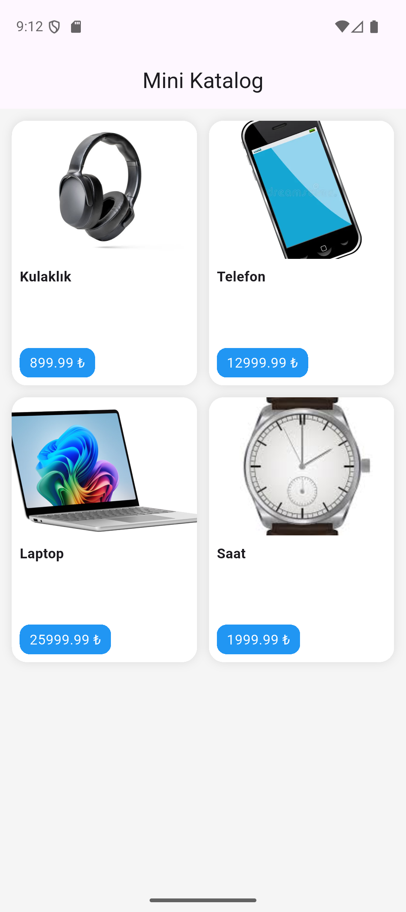
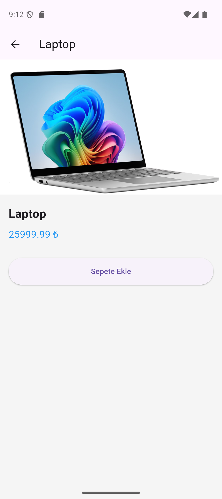

# Mini Katalog Uygulaması

## Proje Tanımı

Bu proje Flutter kullanılarak geliştirilmiş basit bir ürün katalog uygulamasıdır.
Uygulamada ürünler listelenir ve her ürüne tıklandığında detay sayfası açılır.

## Özellikler

- Ürün listeleme (GridView)
- Ürün detay sayfası
- Sayfalar arası geçiş (Navigator)
- Asset tabanlı görseller

## Kullanılan Teknolojiler

- Flutter 3.x
- Dart
- Material Design

## Çalıştırma Adımları

```bash
flutter pub get
flutter run
```

## Ekran Görüntüleri




